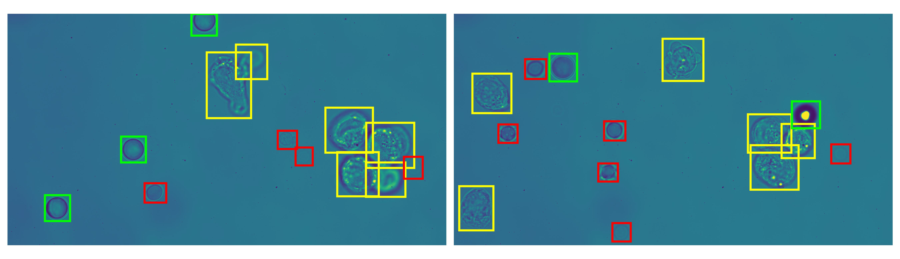

# In-vitro Blood Purification using Tiny Pinch Holographic Optical Tweezers Based on Deep Learning

This repo is built upon [MMDetection](https://github.com/open-mmlab/mmdetection) and adapted for the **B**lood c**O**mpone**N**t **D**etection (BOND) dataset.

## BOND Dataset
The **B**lood c**O**mpone**N**t **D**etection (BOND) dataset simulates in-vitro blood purification scenarios. 
It includes 1485 *4096x2168* images of blood component mixtures with 2D object annotations.
Images and annotations are organized in COCO format.

| Split  | Frames  | MCF-7 cells  | Red Blood Cells  | PS Beads  |
|:------:|:-------:|:------------:|:----------------:|:---------:|
| Train  |  1215   |     1671     |       6677       |   1168    |
|  Test  |   270   |     270      |       2105       |    272    |


*Example images with annotations in the BOND dataset (yellow: MCF-7 cells; red: red blood cells; green: PS beads).*

## Getting Started
Download and extract the [BOND dataset](https://drive.google.com/file/d/1cTuE92t3xpk-O6tZhEErjL79ynAmsAuk/view?usp=sharing) as `data/bond2024`.

### Training
```sh
MODEL_NAME=atss
sh train.sh $MODEL_NAME
```
### Evaluation
```sh
sh evaluate.sh $MODEL_NAME
```
### Benchmarking Inference Speed
```sh
sh benchmark.sh $MODEL_NAME
```

## Performance
| **Method**                                | **AP** | **AP**<sub>MCF-7</sub> | **AP**<sub>PS Bead</sub> | **AP**<sub>Red Blood Cell</sub> | **Frame Rate** |
|-------------------------------------------|:------:|:----------------------:|:------------------------:|:-------------------------------:|:--------------:|
| [ATSS R-101](configs/bond_models/atss.py)                                 | 95.19 |               92.03               |                95.97                |              97.57              |          27.8         |
| [AutoAssign R-50](configs/bond_models/autoassign.py)                      | 93.71 |               91.08               |                92.96                |              97.11              |          35.2         |
| [Cascade RPN R-50-FPN](configs/bond_models/cascade_rpn.py)                | 95.86 |               94.65               |                95.17                |              97.76              |          24.4         |
| [DDOD-ATSS R-50](configs/bond_models/ddod.py)                             | 94.72 |               92.69               |                93.81                |              97.64              |          30.5         |
| [Double-Head R-CNN R-50-FPN](configs/bond_models/double_heads.py)         | 95.30 |               92.74               |                95.51                |              97.65              |          15.4         |
| [Dynamic R-CNN R-50](configs/bond_models/dynamic_rcnn.py)                 | 94.77 |               92.11               |                94.45                |              97.77              |          31.8         |
| [FoveaBox R-101](configs/bond_models/foveabox.py)                         | 93.43 |               89.88               |                92.82                |              97.60              |          25.8         |
| [FreeAnchor X-101-32x4d](configs/bond_models/free_anchor.py)              | 94.52 |               93.06               |                94.18                |              96.34              |          24.4         |
| [NAS-FCOS R-50](configs/bond_models/nas_fcos.py)                          | 94.54 |               91.02               |                95.02                |              97.57              |          23.5         |
| [PAA R-101-FPN](configs/bond_models/paa.py)                               | 93.82 |               91.55               |                92.51                |              97.42              |          15.4         |
| [RepPoints X-101-FPN-DCN](configs/bond_models/reppoints.py)               | 93.50 |               90.03               |                93.19                |              97.28              |          14.6         |
| [Side-Aware Boundary Localization R-101-FPN](configs/bond_models/sabl.py) | 93.25 |               89.83               |                92.34                |              97.59              |          25.8         |
| [TOOD X-101-64x4d](configs/bond_models/tood.py)                           | 96.13 |               95.93               |                94.91                |              97.55              |          14.4         |
| [VarifocalNet X-101-64x4d](configs/bond_models/vfnet.py)                  | 94.43 |               92.98               |                92.64                |              97.68              |          9.6          |
| [YOLOF R-50-C5](configs/bond_models/yolof.py)                             | 91.41 |               87.26               |                91.92                |              95.06              |          52.0         |
